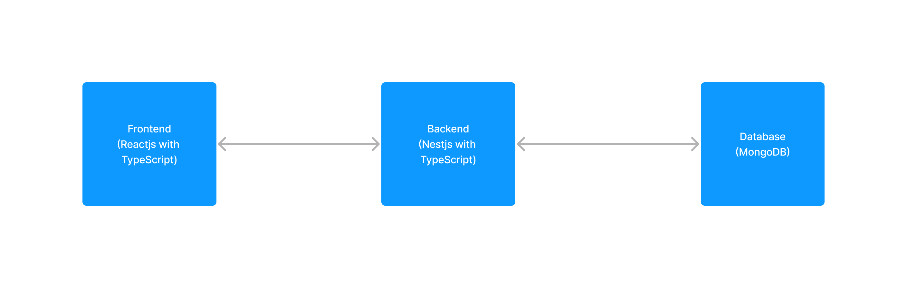

# Fleet Management System

Developed using TypeScript with React on frontend and Nestjs for backend and MongoDB as Database.



## Installation

### Frontend
```bash
cd ./frontend
npm install
```
set env variable `REACT_APP_SERVER_URL` with the backend URL in your root .env file.

### Backend
```bash
cd ./backend
npm install
```

set env variables reference from `.example.env`

## Database
Run ``docker-compose up`` to set up a database and then it is ready to use as env variables are already set in the backend.

## Running Project

### Frontend
```bash
cd ./frontend
npm start
```

### Backend
```bash
cd ./backend
npm start
```

After the backend is started you can see swagger on path `/api`

## Simulation
To add lat lng data using simulation. Register vehicle first, and you will have license no. then
```bash

*for random lat long data*
node simulation.js ${YOUR LICENSE NUMBER HERE}

*for pre defined points*
node simulation2.js ${YOUR LICENSE NUMBER HERE}
```

## Tests
```bash
cd ./backend


*for unit tests*
npm run test


*for e2e tests*
npm run test:e2e

```